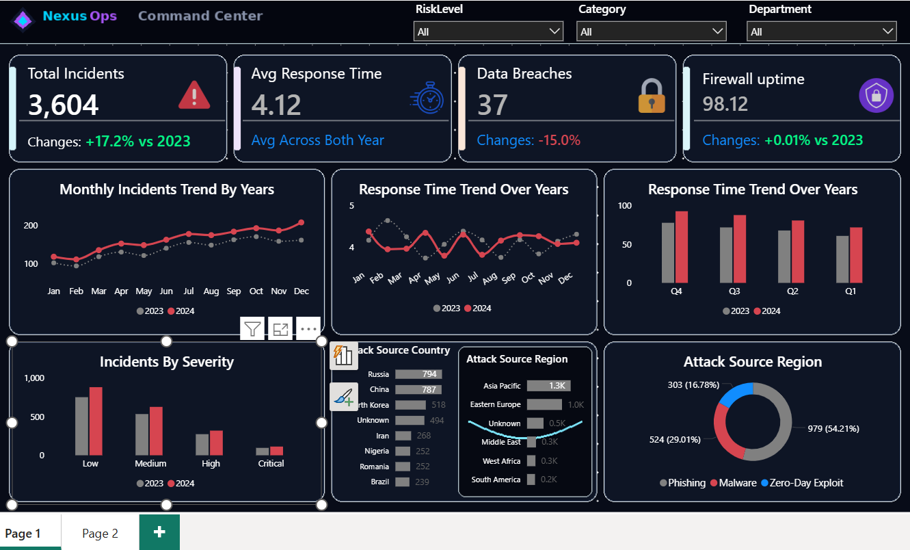
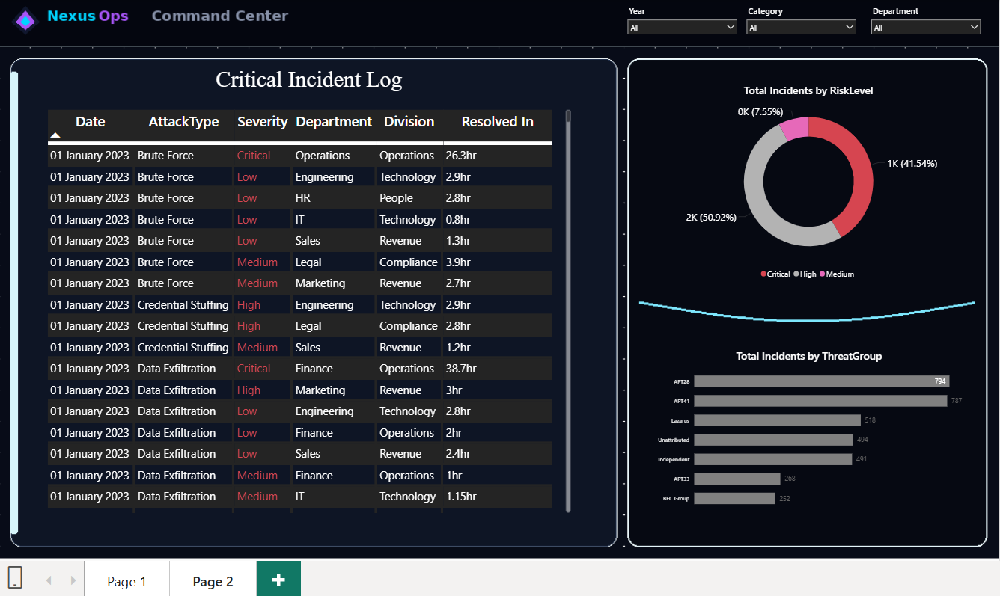

# Cybersecurity Incident Analytics Dashboard — Power BI
**Nexus Ops | Command Center**

## Project Overview
A two-page interactive Power BI dashboard simulating a 
real-world Security Operations Center (SOC) — tracking 
3,604 cybersecurity incidents across threat groups, 
attack sources, severity levels, and response times 
over 2023–2024.

## Dashboard Preview

### Page 1 — Command Center

### Page 2 — Critical Incident Log

## Key Insights Uncovered
- Total Incidents: 3,604 | YoY Growth: +17.2%
- Data Breaches reduced by -15.0% YoY
- Firewall Uptime: 98.12% — near-perfect continuity
- APT28 (794) and APT41 (787) are top threat groups
- Asia Pacific leads attack source regions at 1.3K
- Phishing accounts for 54.21% of all attack types
- Critical Finance incidents took up to 38.7hrs to resolve
- Malware (29.01%) and Zero-Day Exploits (16.78%) 
  complete the attack category breakdown

## Dashboard Pages
**Page 1 — Command Center**
- KPI cards: Total Incidents, Avg Response Time, 
  Data Breaches, Firewall Uptime with YoY comparisons
- Monthly Incidents Trend (2023 vs 2024)
- Response Time Trend by month and quarter
- Incidents by Severity (Low/Medium/High/Critical)
- Attack Source Country and Region breakdown
- Attack Category donut chart

**Page 2 — Critical Incident Log**
- Scrollable incident table: Date, Attack Type, 
  Severity, Department, Division, Resolution Time
- Risk Level distribution donut chart
- Threat Group ranking bar chart

## Filters
- Risk Level | Category | Department | Year

## Tools Used
Power BI Desktop · DAX · Data Modelling · 
Custom Dark Theme · Multi-page Navigation · 
Conditional Formatting · Threat Intelligence Visuals
